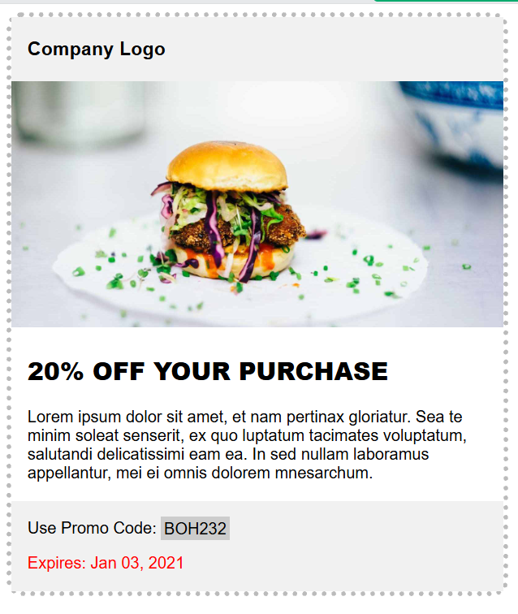

# UF1841

Cada apartado conseguido otorga un punto de la nota final. Puedes modificar todo el código que quieras, pero no deberías necesitar crear reglas nuevas CSS. Haz los ejercicios en orden.

1. Enlaza adecuadamente el fichero **style.css** al _index.html_
2. Cambia el tipo de letra de todo el _body_ a Arial
3. El color del último párrafo debe de ser rojo
4. El color de fondo del código del cupon "BOH232" debe ser exactamente de color #cccccc;
5. Queremos añadir un _padding_ en el contenedor **.container.** 2px arriba y abajo, y 16px a la izquierda y a la derecha.
6. El color de fondo del contenedor **.container** debe ser #f1f1f1;
7. Se utiliza una propiedad CSS adecuada para establecer un **borde** de **5px punteado y de color #bbbbbb** en toda la tarjeta, tal y como se muestra en el diseño.
8. La imagen _img_ no se ve adecuadamente. Carga adecuadamente la imagen de la hamburguesa que se encuentra en este proyecto.

